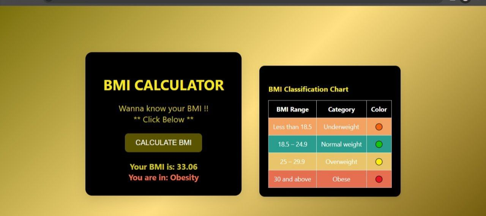

# BMI Calculator 🧮

A simple and interactive Body Mass Index (BMI) calculator built with HTML, CSS, and JavaScript. This project takes user inputs for weight and height, calculates BMI, and categorizes the result as Underweight, Normal, Overweight, or Obese.

## 🔥 Features

- Clean and modern UI with a multi-color gradient background
- Interactive prompt for weight and height input
- BMI calculation and classification
- Category displayed in color-coded format
- Fully responsive and lightweight

## 💻 Technologies Used

- HTML
- CSS (with gradient styling)
- JavaScript

## 🚀 Live Demo

👉 [Click here to view](http://127.0.0.1:5500/index.html)  

## 📸 Screenshots

  

## 📚 BMI Categories

| BMI Range        | Category       |
|------------------|----------------|
| Below 18.5       | Underweight    |
| 18.5 - 24.9      | Normal weight  |
| 25 - 29.9        | Overweight     |
| 30 and above     | Obese          |

## 📦 How to Run Locally

1. Clone the repo:
   `bash
   git clone https://github.com/your-username/bmi-calculator.git
